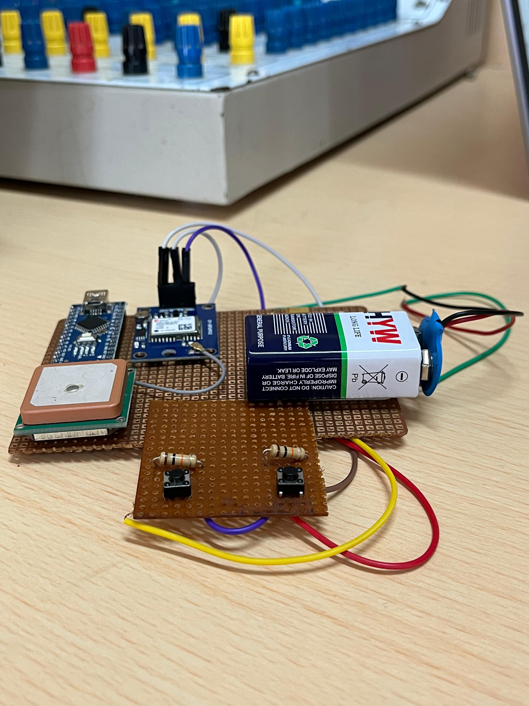

# Women Safety Wearable Device 🚨


An IoT-based wearable emergency alert system. Press one button — ESP32 fetches your
live GPS coordinates and sends them as a clickable Google Maps link via SMS to
predefined contacts. **No smartphone. No internet. No app.**

---

## 🌐 Live Demo

🔗 [Open Website](https://diyasharma22.github.io/women-safety-wearable-device/)

---

## 📊 Performance Results

| Metric | Result |
|---|---|
| GPS Accuracy (outdoor, open sky) | 2.5–5 meters |
| SMS Delivery Time | 8–12 seconds (good network) |
| SOS Response Time | < 2 seconds (interrupt-driven) |
| Battery Life (GPS + GSM active) | ~6 hours continuous |
| Cancel Window After SOS Press | 10 seconds |
| Networks Required | 2G GSM only — no internet needed |

---

## ⚙️ System Architecture

| Layer | Component | Role |
|---|---|---|
| Input | SOS Push Button | Interrupt-driven trigger (GPIO4, active LOW) |
| Location | Neo-6M GPS | NMEA sentence parsing via TinyGPS++ |
| Processing | ESP32 / Arduino | Coordinate formatting, SMS message assembly |
| Communication | SIM800L GSM | AT command SMS transmission to contacts |
| Power | Li-ion + AMS1117 | Regulated 4V supply for GSM stability |

---

## 🚀 Features

- 🚨 One-click SOS emergency alert
- 📍 Real-time GPS location tracking (2.5–5m accuracy)
- 📩 SMS alert with clickable Google Maps link
- ⏱️ 10-second cancel window to avoid false triggers
- 📡 Works on 2G GSM — no internet required
- 🔋 ~6 hours battery life
- 💻 Web dashboard via Bluetooth (ESP32 version)
- 🔒 Interrupt-driven firmware for instant response

---

## 🛠️ Hardware Components

| Component | Quantity | Purpose |
|---|---|---|
| ESP32-WROOM-32 | 1 | Main MCU — Wi-Fi, Bluetooth, GPIO |
| SIM800L GSM Module | 1 | Sends SMS via 2G network |
| Neo-6M GPS Module | 1 | Real-time latitude/longitude |
| SOS Push Button | 1 | Emergency trigger (active LOW, pull-up) |
| Cancel Button | 1 | Cancel SOS within 10-second window |
| Li-ion Battery (3.7V) | 1 | Portable power |
| AMS1117 Voltage Regulator | 1 | Steps 5V → 4V for SIM800L stability |
| Capacitor (1000µF) | 1 | Buffers GSM current spikes |
| Perfboard | 1 | Final assembly |

---

## 🔌 Pin Connections

### ESP32 + Bluetooth Version

| ESP32 Pin | Connected To |
|---|---|
| GPIO16 (RX2) | GPS TX (Neo-6M) |
| GPIO17 (TX2) | GPS RX (Neo-6M) |
| GPIO4 | SOS Button (INPUT_PULLUP, active LOW) |

### Arduino + SIM800L Version

| Arduino Pin | Connected To |
|---|---|
| D2 | SOS Button (INPUT_PULLUP) |
| D3 | Cancel Button (INPUT_PULLUP) |
| D7 (RX) | GSM TX (SIM800L) |
| D8 (TX) | GSM RX (SIM800L) |
| D4 (RX) | GPS TX (Neo-6M) |
| D5 (TX) | GPS RX (Neo-6M) |

---

## 💾 Firmware Overview

Two firmware variants are included:

**`sim800l-code/`** — Arduino + SIM800L (SMS version)
- Interrupt-driven SOS button with 10-second cancel window
- Sends Google Maps link via SMS using AT commands
- Uses `TinyGPS++` for NMEA sentence parsing
- Handles GPS cold start with cached last-known-location fallback

**`esp32-code/`** — ESP32 + Bluetooth (web dashboard version)
- Broadcasts GPS coordinates every 10 seconds via Bluetooth Classic
- On SOS press: sends `SOS,lat,lng` to paired browser
- 50ms hardware debounce on SOS button
- Uses `BluetoothSerial` + Hardware UART2 for GPS

---

## ▶️ Setup Instructions

### Flash the SMS Version (SIM800L)
1. Open `sim800l-code/` in Arduino IDE
2. Edit `phone_number[]` with your emergency contact number
3. Select board: **Arduino Uno/Nano**
4. Upload via Arduino IDE

### Flash the Bluetooth + Web Version (ESP32)
1. Open `esp32-code/` in Arduino IDE
2. Select board: **ESP32 Dev Module**
3. Upload via Arduino IDE
4. Open `index.html` in Chrome
5. Click **Connect ESP32** → pair with `WearableSOS`
6. Add emergency contacts — live location appears on map

---

## 🧪 How It Works

1. On power-up, ESP32 initialises GPS and GSM modules
2. GPS streams NMEA sentences continuously; ESP32 caches latest valid fix
3. SOS button pressed → GPIO interrupt fires instantly
4. 10-second cancel window starts (press cancel button to abort)
5. After 10 seconds without cancel → ESP32 formats SMS:
   `"SOS ALERT! Location: https://maps.google.com/?q=lat,lng"`
6. SIM800L sends SMS via AT commands to predefined contact
7. Recipient clicks Google Maps link → sees exact location

---

## 📷 Project Images

### Wearable Demonstration


### Full System Overview


### Hardware Prototype


### ESP32 Prototype


### Hardware Closeup


---

## 🔧 Technical Challenges & Solutions

**UART conflict between GPS and GSM modules**
Both Neo-6M and SIM800L use UART. Running both simultaneously on the same bus caused
data corruption and garbled AT command responses. Solved using `SoftwareSerial` with
carefully timed sequential reads — GPS parses continuously in the main loop, GSM
transmits only on SOS trigger.

**SIM800L voltage instability**
The module requires exactly 4.0V ±0.2V but draws ~2A peaks during SMS transmission.
These spikes caused ESP32 to reset mid-transmission. Fixed by adding an AMS1117
voltage regulator and a 1000µF capacitor on the SIM800L power line to buffer the
current surge.

**GPS cold start delay**
First satellite fix after power-on takes 30–60 seconds outdoors. If SOS is triggered
before a fresh fix is acquired, the system falls back to the last cached coordinates
so the SMS still sends with a location rather than failing silently.

**Button debouncing false triggers**
Mechanical switch contact bounce generated multiple interrupt triggers on a single
press. Fixed with both hardware (pull-up resistor keeping pin HIGH at rest) and
software (50ms debounce delay before re-arming the interrupt).

**Indoor GPS accuracy degradation**
GPS accuracy drops to 10–15 metre error range indoors due to signal attenuation.
Partially mitigated with an external patch antenna. Full indoor accuracy would require
supplementary Wi-Fi or BLE positioning — noted as future scope.

---

## 📂 Repository Structure

```
women-safety-wearable-device/
│
├── esp32-code/
│   └── esp32_bluetooth.ino      ← ESP32 Bluetooth + GPS firmware
│
├── sim800l-code/
│   └── sim800l_gsm.ino          ← Arduino + SIM800L SMS firmware
│
├── images/                      ← Hardware photos
│
├── index.html                   ← Web dashboard (Bluetooth + Mapbox)
├── script.js
├── style.css
└── README.md
```

---

## 🔮 Future Scope

- [ ] Miniaturize onto custom PCB — wristband/pendant form factor
- [ ] Accelerometer-based automatic fall detection (no button press needed)
- [ ] Firebase/Blynk cloud integration for live tracking dashboard
- [ ] Two-way voice call via SIM800L
- [ ] Multi-contact SMS blast
- [ ] Panic buzzer + LED confirmation on SOS trigger
- [ ] ML-based distress movement pattern detection

---

## 👩‍💻 Team

| Name | GitHub |
|---|---|
| Diya Sharma | [@diyasharma22](https://github.com/diyasharma22) |
| Eipshita Basuli | [@riiverse](https://github.com/riiverse) |
| Richa Datta | [@richaaaa2005](https://github.com/richaaaa2005) |
 
**Institution:** VIT Bhopal University — B.Tech ECE (AI & Cybernetics)

---

## 📜 License

[MIT License](LICENSE) — Open for learning, academic reference, and innovation.
