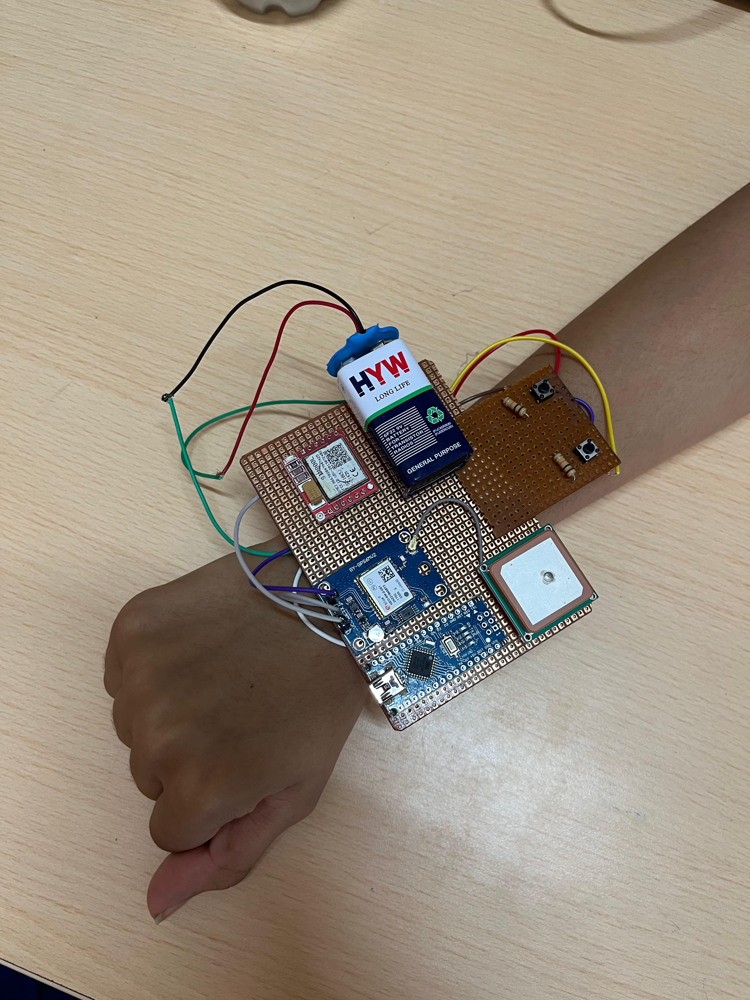
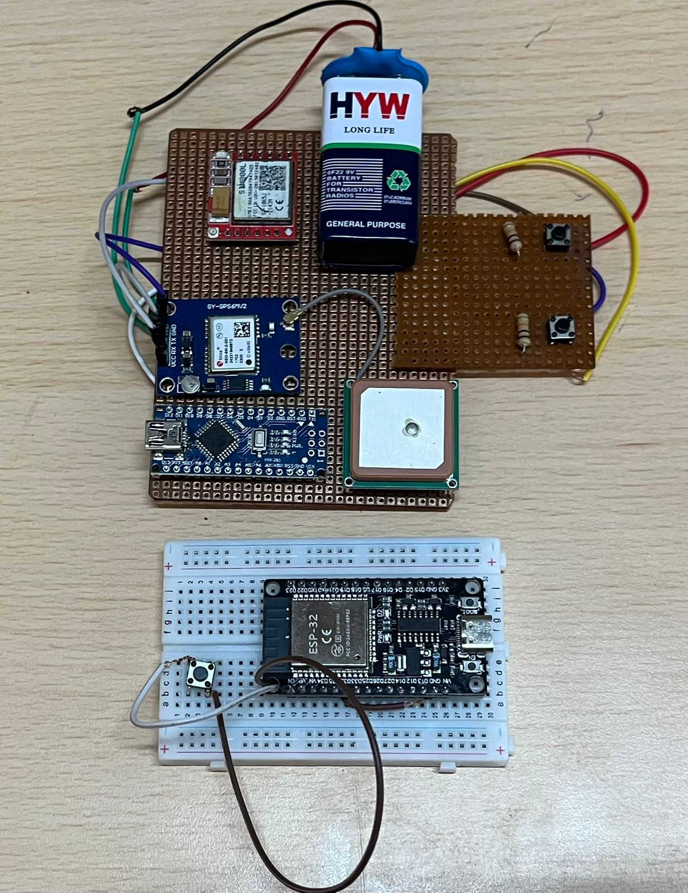
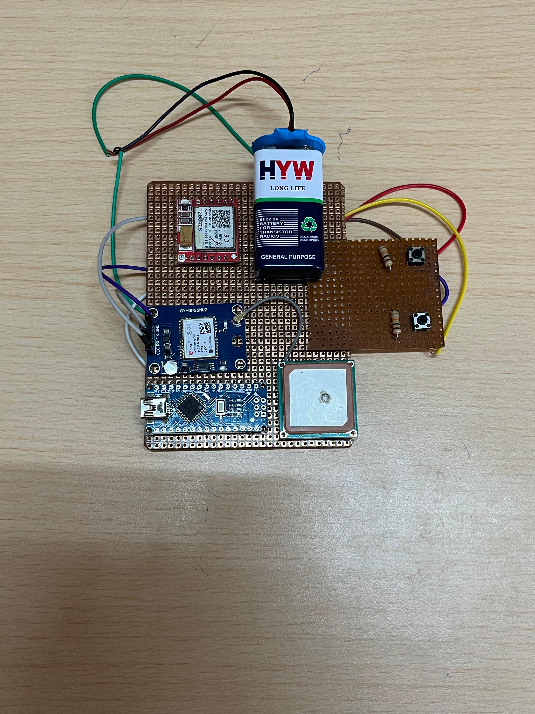
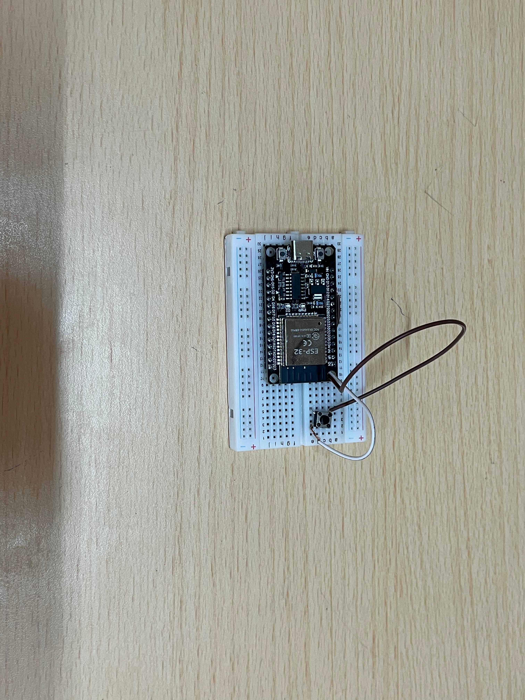

# Women Safety Wearable Device 🚨


An IoT-based wearable emergency alert system designed using ESP32, GPS, and GSM technologies for real-time safety monitoring and SOS alert transmission.

---

# 📌 Features

- 🚨 One-click SOS emergency alert
- 📍 Real-time GPS tracking
- 📩 SMS emergency notifications
- 🌐 Google Maps location sharing
- 📡 ESP32 communication system
- 💻 Web dashboard integration
- 🔋 Portable wearable hardware design

---

# 🛠️ Hardware Components

- ESP32 Development Board
- SIM800L GSM Module
- Neo-6M GPS Module
- Push Buttons
- Battery Supply
- Perfboard Prototype

---

# ⚙️ Working Principle

1. User presses the SOS button.
2. GPS coordinates are fetched.
3. GSM module sends emergency SMS.
4. Google Maps live location is shared.
5. Emergency contacts receive instant alert.

---

# 📷 Project Images

## Wearable Demonstration



---

## Full System Overview



---

## Hardware Prototype



---

## ESP32 Prototype



---

## Hardware Closeup


---

# 📂 Repository Structure

```txt
esp32-code/
sim800l-code/
website/
images/
```

---

# 🚀 Future Improvements

- Mobile application integration
- Cloud database support
- Voice-triggered SOS
- Compact PCB implementation
- AI-based threat detection
- Rechargeable battery system

---

# 👩‍💻 Team Members

- Diya Sharma
- Eipshita Basuli
- Richa Datta

---

# 🎓 Academic Project

Developed at VIT Bhopal University.
